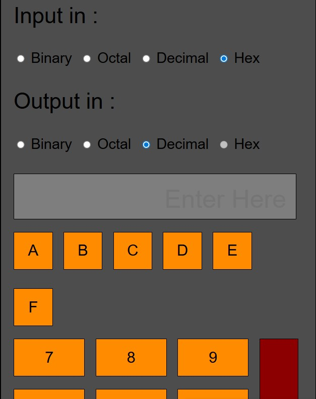

# 🔢 Number System Converter  

A simple **HTML & CSS** project built for my **first-year maths module**.  
It allows users to **convert between various number systems** including:  

- 🧮 **Binary ↔ Decimal**  
- 🧩 **Decimal ↔ Hexadecimal**  
- 💡 **Hexadecimal ↔ Binary**  

This was one of the **first working web projects I ever created**, and I’ve kept it here for **educational purposes** as a reminder of where I started.  

> ⚠️ The code in this repository is **not representative of my current ability** — it’s an early step in my learning journey please ignore the 100 or so if statments 😅.

---

## 🖼️ Preview  

  

---

## 🛠️ Tech Stack  

- **HTML5** – structure and logic  
- **CSS3** – styling and layout  

---

## 🚀 How to Use  

1. Open the `index.html` file in your browser.  
2. Choose your conversion type (e.g. Binary → Decimal).  
3. Enter a value and click **Convert**.  
4. See the result instantly on the page!  

---

## 💭 Notes  

This project was a big milestone for me it helped me understand how number systems work behind the scenes  
and how simple logic can be represented visually with clean web design.  

---

